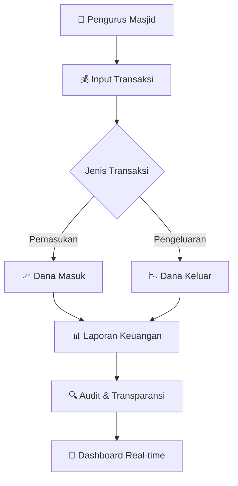
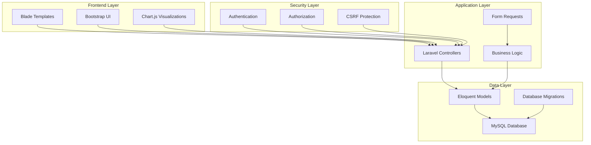

# Simple Sistem Manajemen Kas Masjid
### *Smart Simple Islamic Financial Management System*

<div align="center">

<!-- Islamic Geometric Pattern Header -->
<svg width="800" height="200" viewBox="0 0 800 200" xmlns="http://www.w3.org/2000/svg">
  <defs>
    <linearGradient id="islamicGradient" x1="0%" y1="0%" x2="100%" y2="0%">
      <stop offset="0%" style="stop-color:#1e7e34;stop-opacity:1" />
      <stop offset="30%" style="stop-color:#28a745;stop-opacity:1" />
      <stop offset="70%" style="stop-color:#20c997;stop-opacity:1" />
      <stop offset="100%" style="stop-color:#17a2b8;stop-opacity:1" />
    </linearGradient>
    <filter id="shadow">
      <feDropShadow dx="2" dy="2" stdDeviation="2" flood-color="#000000" flood-opacity="0.3"/>
    </filter>
    <pattern id="islamicPattern" x="0" y="0" width="40" height="40" patternUnits="userSpaceOnUse">
      <circle cx="20" cy="20" r="3" fill="#ffffff" opacity="0.1"/>
      <circle cx="0" cy="0" r="2" fill="#ffffff" opacity="0.05"/>
      <circle cx="40" cy="0" r="2" fill="#ffffff" opacity="0.05"/>
      <circle cx="0" cy="40" r="2" fill="#ffffff" opacity="0.05"/>
      <circle cx="40" cy="40" r="2" fill="#ffffff" opacity="0.05"/>
    </pattern>
  </defs>
  
  <!-- Background with Islamic pattern -->
  <rect width="800" height="200" fill="url(#islamicGradient)"/>
  <rect width="800" height="200" fill="url(#islamicPattern)"/>
  
  <!-- Mosque silhouette -->
  <g transform="translate(350, 40)">
    <!-- Main dome -->
    <ellipse cx="50" cy="60" rx="45" ry="25" fill="#ffffff" opacity="0.9" filter="url(#shadow)"/>
    <!-- Minaret -->
    <rect x="10" y="30" width="8" height="50" fill="#ffffff" opacity="0.9" filter="url(#shadow)"/>
    <rect x="82" y="30" width="8" height="50" fill="#ffffff" opacity="0.9" filter="url(#shadow)"/>
    <!-- Crescent moons -->
    <path d="M 45 35 Q 50 30 55 35 Q 50 40 45 35" fill="#FFD700" opacity="0.9">
      <animateTransform attributeName="transform" type="rotate" values="0 50 35;5 50 35;0 50 35" dur="4s" repeatCount="indefinite"/>
    </path>
    <!-- Stars around -->
    <circle cx="20" cy="20" r="2" fill="#FFD700" opacity="0.8">
      <animate attributeName="opacity" values="0.8;1;0.8" dur="2s" repeatCount="indefinite"/>
    </circle>
    <circle cx="80" cy="25" r="1.5" fill="#FFD700" opacity="0.7">
      <animate attributeName="opacity" values="0.7;1;0.7" dur="3s" repeatCount="indefinite"/>
    </circle>
  </g>
  
  <!-- Floating coins animation -->
  <g opacity="0.6">
    <circle cx="150" cy="80" r="8" fill="#FFD700">
      <animate attributeName="cy" values="80;60;80" dur="3s" repeatCount="indefinite"/>
      <animate attributeName="opacity" values="0.6;1;0.6" dur="3s" repeatCount="indefinite"/>
    </circle>
    <circle cx="650" cy="120" r="6" fill="#FFA500">
      <animate attributeName="cy" values="120;100;120" dur="2.5s" repeatCount="indefinite"/>
      <animate attributeName="opacity" values="0.6;1;0.6" dur="2.5s" repeatCount="indefinite"/>
    </circle>
  </g>
  
  <!-- Title text with glow effect -->
  <text x="400" y="130" text-anchor="middle" fill="#ffffff" font-family="Arial, sans-serif" font-size="28" font-weight="bold" filter="url(#shadow)">
    SISTEM MANAJEMEN KAS MASJID
  </text>
  <text x="400" y="155" text-anchor="middle" fill="#FFD700" font-family="Arial, sans-serif" font-size="14" opacity="0.9">
    Mengelola Keuangan Masjid dengan Amanah & Transparan
  </text>
</svg>

<br>


[](LICENSE)
[](STATUS)
[](VERSION)

</div>

---

## 🌟 Overview

**Sistem Manajemen Kas Masjid** adalah aplikasi web modern yang dibangun dengan Laravel untuk membantu pengurus masjid mengelola keuangan dengan lebih **transparan**, **akuntabel**, dan **efisien**. Sistem ini mengintegrasikan prinsip-prinsip syariah dalam pengelolaan keuangan masjid.

<div align="center">



</div>

---

## ✨ Key Features

<div align="center">

| 🎯 **Core Features** | 📊 **Reporting** | 🔒 **Security** | 🎨 **UI/UX** |
|:---:|:---:|:---:|:---:|
| Pencatatan Pemasukan | Laporan Bulanan | Role-based Access | Responsive Design |
| Pencatatan Pengeluaran | Laporan Tahunan | Data Encryption | Islamic Theme |
| Kategori Transaksi | Export PDF/Excel | Audit Trail | Real-time Updates |
| Multi-user Support | Dashboard Analytics | Backup System | Dark/Light Mode |

</div>

### 🚀 Advanced Features:

- **💡 Smart Categories**: Kategorisasi otomatis berdasarkan jenis transaksi syariah
- **📈 Real-time Analytics**: Dashboard dengan grafik interaktif
- **🔔 Notification System**: Pengingat untuk transaksi penting
- **📱 Mobile Responsive**: Akses mudah dari berbagai device
- **🎨 Islamic Design**: Interface yang sesuai dengan nilai-nilai Islam
- **🔐 Multi-level Authentication**: Akses terkontrol berdasarkan peran

---

## 🛠️ Tech Stack

<div align="center">

### Backend Technologies


### Frontend Technologies


### Development Tools


</div>

---

##  Quick Start

### Prerequisites
```bash
# Required Software
PHP >= 8.1
Composer >= 2.0
Node.js >= 16.x
MySQL >= 8.0
```

### Installation

<details>
<summary>📋 <strong>Click to expand installation steps</strong></summary>

```bash
# 1. Clone the repository
git clone https://github.com/rubysy/mosque-cashflow-system.git
cd mosque-cashflow-system

# 2. Install PHP dependencies
composer install

# 3. Install Node.js dependencies
npm install && npm run dev

# 4. Environment setup
cp .env.example .env
php artisan key:generate

# 5. Database configuration
# Edit .env file with your database credentials
DB_CONNECTION=mysql
DB_HOST=127.0.0.1
DB_PORT=3306
DB_DATABASE=mosque_cashflow
DB_USERNAME=your_username
DB_PASSWORD=your_password

# 6. Run migrations and seeders
php artisan migrate --seed

# 7. Start the development server
php artisan serve
```

🎉 **Application will be available at: http://localhost:8000**

</details>

---

## 📊 System Architecture

<div align="center">



</div>

---

## 💰 Transaction Flow

<div align="center">

### Pemasukan (Income) Sources
```
🎯 Infaq & Sedekah    💰 Zakat Fitrah    🏠 Sewa Fasilitas
📿 Qurban            💒 Hibah            🎓 Kursus/Pelatihan
```

### Pengeluaran (Expense) Categories  
```
⚡ Listrik & Air     🧹 Kebersihan      🔧 Pemeliharaan
👨‍💼 Honor Pengurus    📚 Kegiatan        🍽️ Konsumsi
```

</div>

---

## 📱 Screenshots & Features

<div align="center">

### 🎨 Modern Dashboard
> Real-time financial overview dengan Islamic design principles

### 📊 Interactive Reports
> Grafik dan chart yang mudah dipahami untuk analisis keuangan

### 📋 Transaction Management
> Input dan manage transaksi dengan validasi yang ketat

### 👥 User Management
> Role-based access control untuk keamanan data

</div>

---

## 🎯 Roadmap

<div align="center">

| Phase | Status | Features |
|:---:|:---:|:---|
| **Phase 1** | ✅ Complete | Basic CRUD, Authentication, Reports |
| **Phase 2** | 🚧 In Progress | Advanced Analytics, Export Features |
| **Phase 3** | 📋 Planned | Mobile App, API Integration |
| **Phase 4** | 💭 Future | AI Insights, Multi-language Support |

</div>

### 🔮 Upcoming Features:
- **📱 Mobile Application** (React Native)
- **🤖 AI-powered Financial Insights**
- **📊 Advanced Business Intelligence**
- **🌐 Multi-language Support** (Arabic, English, Indonesian)
- **☁️ Cloud Integration** dengan backup otomatis

---

## 🤝 Contributing

Kami menyambut kontribusi dari komunitas! Berikut cara berkontribusi:

<div align="center">

```mermaid
gitgraph
    commit id: "Fork Repository"
    commit id: "Create Feature Branch"
    commit id: "Make Changes"
    commit id: "Write Tests"
    commit id: "Submit PR"
    commit id: "Code Review"
    commit id: "Merge to Main"
```

</div>

### 📋 Contribution Guidelines:
1. **Fork** repository ini
2. **Create** feature branch (`git checkout -b feature/AmazingFeature`)
3. **Commit** perubahan (`git commit -m 'Add some AmazingFeature'`)
4. **Push** ke branch (`git push origin feature/AmazingFeature`)
5. **Open** Pull Request

---

## 🔧 Development Setup

<details>
<summary>🛠️ <strong>Advanced Development Configuration</strong></summary>

```bash
# Development tools
composer require --dev laravel/sail
composer require --dev barryvdh/laravel-debugbar
composer require --dev nunomaduro/collision

# Testing setup
php artisan test
composer run test-coverage

# Code quality
composer require --dev squizlabs/php_codesniffer
./vendor/bin/phpcs --standard=PSR12 app/

# Database optimization
php artisan optimize
php artisan config:cache
php artisan route:cache
```

</details>

---

## 📄 API Documentation

<div align="center">

| Endpoint | Method | Description | Auth Required |
|:---------|:-------|:------------|:------------:|
| `/api/transactions` | GET | List all transactions | ✅ |
| `/api/transactions` | POST | Create new transaction | ✅ |
| `/api/reports/monthly` | GET | Monthly financial report | ✅ |
| `/api/dashboard/stats` | GET | Dashboard statistics | ✅ |

</div>

---

##  Credits & Acknowledgments

<div align="center">

### 👨‍💻 Development Team
**Lead Developer**: [RubySy](https://github.com/rubysy)

### 🎨 Design Inspiration
- Islamic geometric patterns dan color schemes
- Material Design principles untuk UX yang optimal
- Community feedback dari pengurus masjid

### 📚 Built With Love Using:
[](https://laravel.com)
[](https://getbootstrap.com)

</div>

---

## 📞 Support & Contact

<div align="center">

[](https://github.com/rubysy/mosque-cashflow-system/issues)
[](mailto:rbysysf@gmail.com)
[](https://instagram.com/rbysysf)

### 💬 Need Help?
-  **Bug Reports**: [Create an Issue](https://github.com/rubysy/mosque-cashflow-system/issues)
-  **Feature Requests**: [Start a Discussion](https://github.com/rubysy/mosque-cashflow-system/discussions)
-  **Direct Contact**: rbysysf@gmail.com

</div>

---

## 📜 License

<div align="center">

This project is licensed under the **MIT License** - see the [LICENSE](LICENSE) file for details.

```
MIT License - Feel free to use this project for your mosque or religious organization
```

---


</div>
